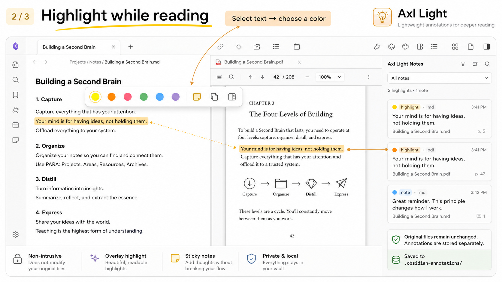

# Book Note（中文文档）

> 一款非侵入式的 Obsidian 阅读批注插件。在 **Markdown / PDF / EPUB** 中统一做标注——高亮、笔记与标签都存放在独立的 sidecar 文件里，因此你的原始文档**绝不会被改动**。

[English documentation](./README.md)




---

## 为什么是 Book Note

多数批注工具会直接修改你的源文件。Book Note 反其道而行：每条高亮、笔记和阅读进度都写入 vault 配置旁侧的 sidecar JSON，原始文档保持逐字节不变。重命名、移动或删除源文件时，插件会自动迁移其批注。

它从单一的「Markdown / PDF 批注」工具，演进为覆盖 **EPUB 全文阅读（foliate-js 引擎）+ 统一批注面板 + 摘录导出 + 双向溯源** 的综合阅读平台。

---

## 核心特性

### EPUB 阅读（foliate-js 引擎）

- **完整阅读体验**——分页 / 滚动、字号调节、以及 **6 种阅读主题**（跟随 Obsidian、白、暖光、护眼绿、羊皮纸、夜间）。
- **6 色高亮 + 想法标注**——选中文本弹出浮动菜单，画线或写想法。
- **全文搜索**——工具栏搜索图标，搜索当前章节正文。
- **阅读进度**——自动保存位置 + 阅读时间统计 + 剩余时间估算。
- **多格式支持**——foliate 原生支持 EPUB / MOBI / AZW3 / FB2 / CBZ / TXT。

### 统一批注面板

- **三格式统一**——Markdown / PDF / EPUB 批注汇入同一个总览面板。
- **筛选与搜索**——按颜色 / 类型 / 标签筛选，关键词搜索批注内容。
- **语义标签**——默认提供「洞见 / 疑问 / 提醒」；最多启用 5 个标签，可改名、排序、停用、设置预设图标、恢复默认（名称会做空格 / 全半角 / 大小写归一化，并强制禁止重复）。
- **行内编辑**——直接在面板编辑想法、添加笔记。
- **跳转**——点卡片跳回原文对应位置（Markdown 偏移 / PDF 页码 / EPUB CFI）。
- **导出**——Markdown 摘要 / 按颜色分组 / 阅读笔记等多种格式。

### 统一导出 + 双向溯源

- **导出批注**——侧栏底部「导出批注」统一导出 Markdown / PDF / EPUB 标注。
- **统一深链**——摘录和侧栏均可生成 `obsidian://book-note` 链接，点击后精确回到 Markdown、PDF 或 EPUB 批注。
- **兼容回链**——保留旧 EPUB / PDF 导出中的隐藏定位锚点，升级后旧摘录仍可使用。

### PDF 批注

- 覆盖层高亮矩形 + 便签。
- 选区检测 + 颜色标注。
- 汇入统一批注面板。

### Markdown 批注

- CM6 编辑模式高亮扩展。
- 阅读模式高亮后处理。
- 点击高亮弹出便签。

---

## 安装

### 通过 BRAT（推荐）

1. 安装 [BRAT](https://github.com/TfTHacker/obsidian42-brat) 插件。
2. BRAT → Add Plugin → 填入仓库地址：`hellokunzai/obsidian-book-note`。
3. 安装后启用「Book Note」。
4. **重要**：更新后请**完全退出 Obsidian 再重开**（仅 reload 插件不够）。

### 手动

1. 从 [Releases](https://github.com/hellokunzai/obsidian-book-note/releases) 下载 `main.js`、`manifest.json`、`styles.css`。
2. 放入 `<vault>/.obsidian/plugins/book-note/`。
3. 设置 → 第三方插件 → 启用「Book Note」。

### 打开 EPUB 的前置条件

Obsidian 默认隐藏未知扩展名。要让 `.epub` 显示在文件树中：

- 设置 → 文件与链接 → 开启**「检测所有文件扩展名」**。

---

## 设置

在 **设置 → Book Note** 中配置：

| 设置 | 说明 |
|------|------|
| 默认高亮颜色 | 新建高亮的默认色。 |
| 默认作者 | 批注署名。 |
| 重命名时迁移批注 | 源文件重命名 / 移动时，迁移其 sidecar 批注并更新链接。 |
| 批注标签 | 管理语义标签——最多启用 5 个，可改名、排序、停用、设置预设图标、恢复默认（空格 / 全半角 / 大小写归一化，禁止重名）。 |
| EPUB 字号 | 正文基础字号（px，12–28），重新打开电子书生效。 |
| EPUB 阅读主题 | 6 种主题之一。 |
| EPUB 翻页模式 | 分页（翻页）/ 滚动（连续）。 |
| EPUB 高亮样式 | 填充 / 下划线 / 波浪线。 |
| PDF 阅读进度 | 是否记录当前页与阅读进度；关闭不删除已有进度。 |

---

## 命令与快捷键

| 命令 | 快捷键 | 功能 |
|------|--------|------|
| 高亮选中文本 | `Ctrl/Cmd+Shift+H` | Markdown / PDF 选区高亮。 |
| 为选中文本添加便签 | `Ctrl/Cmd+Alt+M` | 为选区添加想法。 |
| 打开批注总览 | — | 打开 Book Note 侧栏。 |
| 打开 EPUB 书架 | — | 浏览 vault 内电子书。 |
| 显示 PDF 目录 | — | 列出当前 PDF 的目录。 |
| 测试 Book Note 存储 | — | 校验 sidecar 目录写入权限。 |

> `Mod` 在 Windows / Linux 上为 `Ctrl`，在 macOS 上为 `Cmd`。

---

## 数据存储

所有批注数据存放在 `<vault>/.obsidian-annotations/` 下的 sidecar JSON 中：

- 每个被批注的文件对应一个 `<filename>.json`。
- 包含：高亮、笔记、阅读进度，以及为兼容旧版保留的历史字段。
- **原始文档零修改**，删除某个 sidecar 即可清除该文件的批注。

```text
.obsidian-annotations/
  index.json
  notes__reading__book.md.json      # Markdown 批注
  papers__example.pdf.json           # PDF 批注
  books__novel.epub.json             # EPUB 批注（含 CFI 锚点和阅读进度）
```

### 深链

Book Note 生成的链接形如：

```text
obsidian://book-note?file=<vault 相对路径>&id=<批注 id>
obsidian://book-note-epub?file=<vault 相对路径>&cfi=<epub-cfi>   # 旧版 EPUB 链接
```

点击链接会打开对应文件并滚动到精确批注位置。

---

## 技术架构

- **EPUB 引擎**：[foliate-js](https://github.com/johnfactotz/foliate-js) 1.0.1（单引擎，原生多格式）。
- **渲染**：`foliate-view` 自定义元素嵌入 Obsidian leaf，CSP / sandbox 补丁适配桌面端。
- **数据层**：sidecar JSON（`AnnotationStore`），统一为 `FileAnnotationDocument` 模型。
- **标注同步**：`renderedAnnotationMeta` 跟踪 foliate 高亮层，保证增删即时刷新。
- **非侵入**：所有批注以 overlay 叠加，不触碰原文。

---

## 开发

```bash
npm install
npm run dev      # 开发构建（含 sourcemap）
npm run build    # 生产构建
```

类型检查：

```bash
npx tsc --noEmit
```

将 `main.js`、`manifest.json`、`styles.css` 复制到 `<vault>/.obsidian/plugins/book-note/` 即可在 vault 中测试。

---

## 许可

[MIT](./LICENSE)

## 致谢与参考

- [foliate-js](https://github.com/johnfactotz/foliate-js) — EPUB 渲染引擎。
- [obsidian-weave-reader](https://github.com/) — foliate 集成、脚注 / 搜索 / Canvas 参考。
- [ob-epub-reader](https://github.com/) — 摘录回跳、深链方案参考。
- [Axl Light](https://github.com/rezonegame/axl-light) — 原始项目基础。
